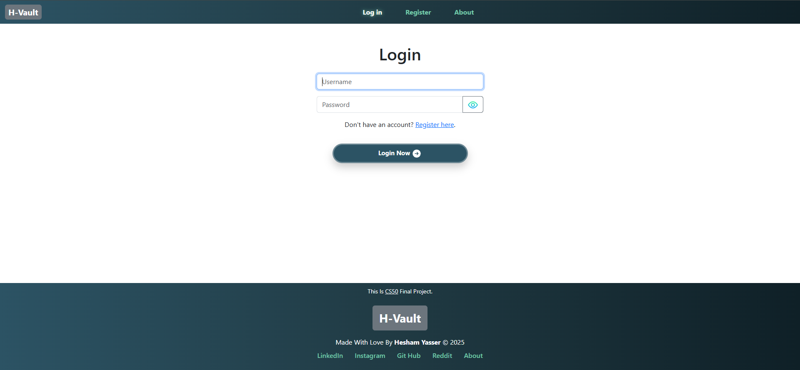

# H-Vault 🔐

H-Vault is a web application that made by Hesham Yasser (H in H-Vault refers to Hesham) for CS50 final project. H-Vault allows users to register, log in, generate strong passwords, know how to stay safe online and secure password manager designed to help user store and manage all his passwords safely. H-Vault uses strong encryption to protect user passwords.

## Built With
- Python (Flask)
- HTML, CSS
- Bootstrap 5
- SQLite Database
- Cryptography & Werkzeug Security for password hashing and encryption

## Features
- User registration and login  
- Password hashing  
- Secure vault to store passwords uses strong encryption
- Organize and manage multiple passwords accounts easily
- Generate strong and random passwords instantly
- Full article to know how to stay safe online
- Responsive and friendly design with Bootstrap 
- Mobile Friendly UI

## Features Plans
Planned improvements include adding two-factor authentication, cloud synchronization, and a browser extension for quicker access.

## Installation
1. Clone the repository  
   `bash git clone https://github.com/Hesham0001/h-vault.git`
2. Navigate to the project folder
    `cd h-vault`
3. Make sure there is vault.db and it's `.schema` is
    ```
    CREATE TABLE users (
           id INTEGER PRIMARY KEY AUTOINCREMENT,
           username TEXT NOT NULL UNIQUE,
           hash TEXT NOT NULL,
           hint TEXT
       );
       CREATE TABLE sqlite_sequence(name,seq);
       CREATE TABLE accounts (
            id INTEGER PRIMARY KEY AUTOINCREMENT,
            user_id INTEGER NOT NULL,
            platform TEXT NOT NULL,
            account_username TEXT NOT NULL,
            password_encrypted TEXT NOT NULL,
            FOREIGN KEY(user_id) REFERENCES users(id)
        );
    ```
3. Install dependencies
    `pip install -r requirements.txt`
4. Run the app
    `flask --app hvault run`

## Demo
Watch the demo video here: [YouTube Link](https://youtu.be/y8GWhRY36MY)

## Screenshots




## About Me
Developed by Hesham Yasser — a high school student (2025) from Egypt. I have had a passion for programming and coding since I was young, and this passion has continued to grow. I really enjoy creating and developing anything related to tech. I am focusing on improving my skills and gaining more experience mainly in cybersecurity and also in programming. Feel free to contact me through my social media links below.
- Email: heshamyasser2409@gmail.com
- LinkedIn: https://www.linkedin.com/in/hesham-yasser0001/
- Instagram: https://www.instagram.com/heshamyasser37/
- GitHub: https://github.com/Hesham0001/
- Reddit: https://www.reddit.com/user/Hesham_37/ 

## License
This project is licensed under the MIT License - see the [LICENSE](./LICENSE) file for details.
